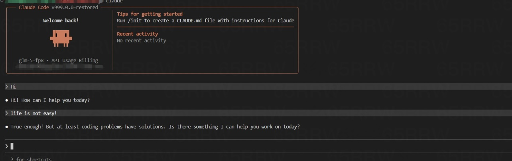

# Restored Claude Code Source

[中文](./README.md)



This repository contains the Claude Code source tree, primarily reconstructed via source map reverse engineering, with missing modules supplemented afterward.

It does not represent the original upstream state. Some files could not be recovered from source maps alone, so the repository currently includes compatibility shims or degraded implementations to allow the project to be reinstalled and run.

## Restored Content

The recent round of restoration has recovered several key components beyond the initial source-map import:

- The default Bun script now follows the real CLI bootstrap path
- Bundled skill content for `claude-api` and `verify` has been restored from placeholders to usable reference documentation
- Compatibility layers for Chrome MCP and Computer Use MCP now expose more realistic tool catalogs and return structured degraded responses instead of empty stubs
- Some explicit placeholder resources have been replaced with usable planning and permission-classifier fallback prompts

The remaining gaps are mainly concentrated in private or native integration parts, which cannot be fully restored from source maps alone, so these areas still rely on shims or degraded behavior.

## Why This Repository Exists

Source maps themselves do not contain the complete original repository:

- Type-specific files are often missing
- Build-time generated files may not exist
- Private package wrappers and native bindings may not be recoverable
- Dynamic imports and resource files are frequently incomplete

The goal of this repository is to fill these gaps to an "usable, runnable" level, forming a workable restoration workspace that can be further improved.

## How to Run

### Quick Start (Recommended)

Use the installation script to **automatically configure** the environment and start:

```bash
./install.sh
```

After installation, run `source ~/.bashrc` as prompted, then launch with the `claude` command.

### Manual Installation

Requirements:

- Bun 1.3.5 or higher
- Node.js 24 or higher

Install dependencies:

```bash
bun install
```

Run the restored CLI:

```bash
bun run dev
```

Output the restored version:

```bash
bun run version
```
